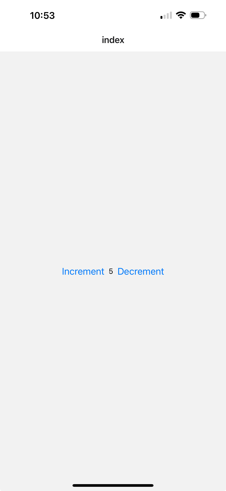

# Counter

## Requirements
- Simple UI to display a number.
- Buttons for 
   - increment ✅
   - decrement ✅
   - reset ✅

## Things to Use
- React Native components: View, Text, Button.
- State management with useState.

## Acceptance Criteria
- Counter increments/decrements/reset correctly.
- Basic styling is applied using StyleSheet.

## Get started

1. Install dependencies

   ```bash
   npm install
   ```

2. Start the app

   ```bash
    npx expo start
   ```

## Image

